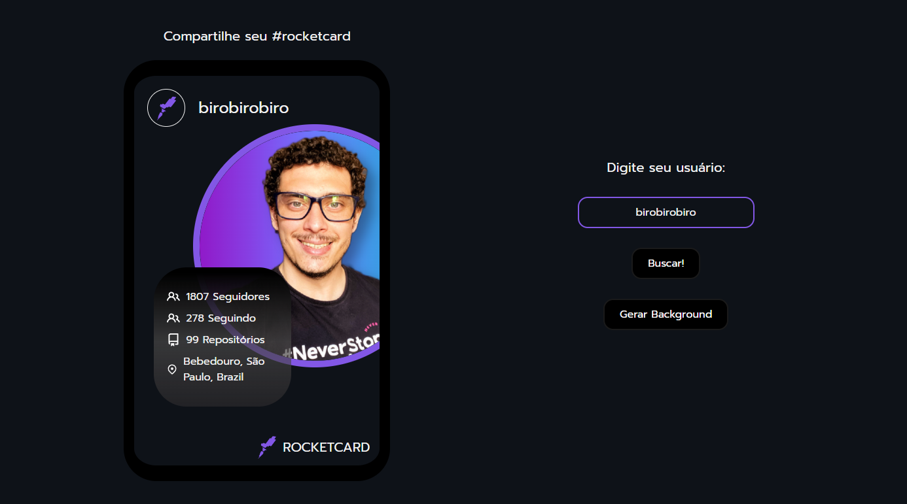

<h1 align="center"> Rocketcard </h1>

Este é um dos desafios disponíveis na plataforma Rocketseat, feito para exercício de conhecimentos em HTML, CSS e Javascript. 😁 
 
 
Projeto totalmente adaptado para a biblioteca React.

<strong><a href="https://marcosassilva.github.io/rocketcard-react/">Acesse o projeto aqui!</a></strong>
  

  <a href="#-tecnologias">Tecnologias</a>&nbsp;&nbsp;&nbsp;|&nbsp;&nbsp;&nbsp;
  <a href="#-projeto">Projeto</a>&nbsp;&nbsp;&nbsp;|&nbsp;&nbsp;&nbsp;
  <a href="#-layout">Layout</a>&nbsp;&nbsp;&nbsp;|&nbsp;&nbsp;&nbsp;
  <a href="#memo-licença">Licença</a>

 

  

## 🚀 Tecnologias

Esse projeto foi desenvolvido com as seguintes tecnologias:

- HTML e CSS
- JavaScript
- React
- Git e Github
- Figma

## 💻 Projeto

Trata-se de uma página que consome a API do [Github](https://www.github.com/) retorna username, avatar e outros dados em formato de card.

<strong>Features adicionais:</strong>

- Verificação se usuário é existente.
- Possibilidade de escolha do usuário desejado.
- Link para acesso do perfil no Github.

[Visite o projeto online.](https://marcosassilva.github.io/rocketflix/)

## 🔖 Layout

Você pode visualizar o layout do projeto através [DESSE LINK](https://www.figma.com/file/7nZh32Uyn4nBgSgzjwdAT1/DD-%2F-Rocketcard-(Copy)?node-id=3-2&t=G3HnTRWnAFJLdaix-0). É necessário ter conta no [Figma](https://figma.com) para acessá-lo.

## 📜 Licença

Esse projeto está sob a licença MIT.
